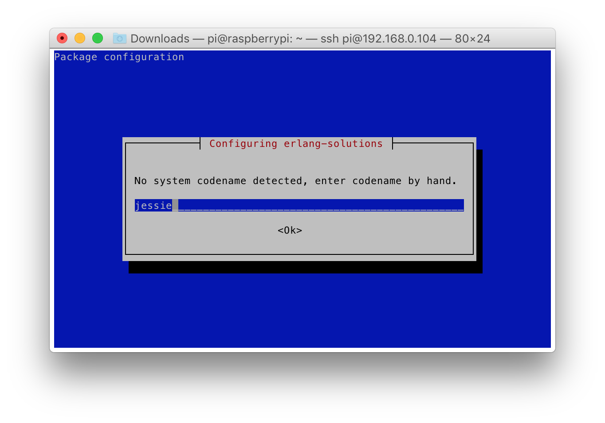

### [](#setup-rpi) Setting up RaspberryPi

Any RaspberryPi that can be connected to a local network is good enough. Start
with downloading the latest Raspbian Lite operating system
from [https://www.raspberrypi.org/downloads/raspbian/](raspberrypi.org). Then
"burn" it to a SD card, e.g. the command on macOS 10.12 could look like:

```
$ sudo dd bs=1m if=2017-01-11-raspbian-jessie-lite.img of=/dev/rdisk2
1326+0 records in
1326+0 records out
1390411776 bytes transferred in 273.912655 secs (5076114 bytes/sec)
```

It is good to have the first RaspberryPi boot from the fresh SD card with a
monitor attached, so that you can troubleshoot any problems. If the first boot
goes well, you should see a login prompt. Use login `pi` and password
`raspberry`. Then type `ifconfig` to read the IP address of the eth0 network
interface. Enable SSH daemon with `sudo raspi-config` (option 7 Advanced
Options) and reboot. Assuming the RaspberryPi is connected to a local network,
From now on you should be able to ssh to it from your laptop's terminal, e.g.

````
$ ssh pi@192.168.0.104
pi@192.168.0.104's password: 

The programs included with the Debian GNU/Linux system are free software;
the exact distribution terms for each program are described in the
individual files in /usr/share/doc/*/copyright.

Debian GNU/Linux comes with ABSOLUTELY NO WARRANTY, to the extent
permitted by applicable law.
Last login: Mon Jan 16 21:45:43 2017 from 192.168.0.102

SSH is enabled and the default password for the 'pi' user has not been changed.
This is a security risk - please login as the 'pi' user and type 'passwd' to set a new password.

pi@raspberrypi:~ $
```

### [](#setup-erlang) Installing Erlang for RaspberryPi

To add Erlang Solutions repository (including the public key for apt-secure) to
your system, call the following commands:

```
pi@raspberrypi:~ $ wget https://packages.erlang-solutions.com/erlang-solutions_1.0_all.deb
pi@raspberrypi:~ $ sudo dpkg -i erlang-solutions_1.0_all.deb
```

If prompted for the codename, enter `jessie` like here:



Continue installation with updating the APT, you should see
binaries.erlang-solutions.com repository included in the list:

```
$ sudo apt-get update
Get:1 http://mirrordirector.raspbian.org jessie InRelease [14.9 kB]
Get:2 http://archive.raspberrypi.org jessie InRelease [22.9 kB]                
[...]
Ign http://binaries.erlang-solutions.com jessie InRelease                      
Get:6 http://binaries.erlang-solutions.com jessie Release.gpg [836 B]          
Get:7 http://binaries.erlang-solutions.com jessie Release [3687 B]             
Get:8 http://binaries.erlang-solutions.com jessie/contrib armhf Packages [31.0 kB]
Ign http://binaries.erlang-solutions.com jessie/contrib Translation-en         
[...]
Fetched 9354 kB in 55s (169 kB/s)                                              
Reading package lists... Done
```

Install Erlang base package, which provides Erlang runtime.

```
pi@raspberrypi:~ $ sudo apt-get install erlang-base
Reading package lists... Done
Building dependency tree       
Reading state information... Done
The following extra packages will be installed:
  erlang-crypto erlang-syntax-tools
Suggested packages:
  erlang-tools erlang erlang-manpages erlang-doc
The following NEW packages will be installed:
  erlang-base erlang-crypto erlang-syntax-tools
0 upgraded, 3 newly installed, 0 to remove and 63 not upgraded.
Need to get 7277 kB of archives.
After this operation, 14.1 MB of additional disk space will be used.
Do you want to continue? [Y/n] Y
Get:1 http://binaries.erlang-solutions.com/debian/ jessie/contrib erlang-base armhf 1:19.2-1 [6811 kB]
Get:2 http://binaries.erlang-solutions.com/debian/ jessie/contrib erlang-crypto armhf 1:19.2-1 [106 kB]
Get:3 http://binaries.erlang-solutions.com/debian/ jessie/contrib erlang-syntax-tools armhf 1:19.2-1 [360 kB]
Fetched 7277 kB in 8s (897 kB/s)                                               
[...]
Setting up erlang-syntax-tools (1:19.2-1) ...
```

Start Erlang shell

```
pi@raspberrypi:~ $ erl
Erlang/OTP 19 [erts-8.2] [source] [async-threads:10] [kernel-poll:false]

Eshell V8.2  (abort with ^G)
1> 
```
